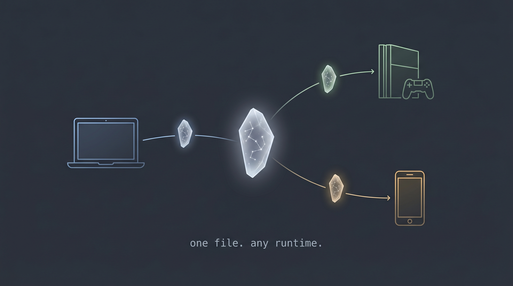

# SHARDCORE

<p align="center">
  

**A portable file format for AI characters that you take care of. Companions, NPCs, agents, anyone you can imagine. Persistent, capable, and alive between the moments you talk to them.**

A `.shard` is a verifiable ZIP archive. The one required pillar is a **soul**
(identity, personality, a closed ten-stat block). Everything else is optional
and self-describing: a **shell** (body, anatomy), a **mind** (tiered memory),
a **neural substrate** that keeps ticking whether anyone is watching or not,
plus canon, stats, world, body, and assets. This is the first step toward
persistent, living AI entities.

> **What SHARDCORE is and isn't.** SHARDCORE is a structured bundle
> format, not a prompt convention. A `.shard` is a versioned ZIP container
> of typed JSON pillars with a manifest carrying per-file SHA-256 digests
> and per-file schema ids, not a markdown file, a system-prompt fragment,
> or a character-card schema. The format, its pillars, and the Neuronshard
> substrate are original work first published in this repository. Surface
> similarity to filename conventions in unrelated projects (e.g.
> `soul.md`) is coincidental and shares no lineage with this spec.

> **TL;DR for engineers.** `.shard` files are ZIP bundles describing
> characters with persistent neural state, verified by SHA-256, runnable
> in pure Python. Only `manifest.json` + `soulshard.json` are required;
> every other pillar is optional and carries its own schema id. v1.9 spec
> + a 1.9.0 reference library that reads, verifies, diagnoses, migrates,
> and repacks bundles. Skip to [Quickstart](#quickstart) to run something now.

---

## What it's for

A `.shard` is a character file. It carries everything one AI character
is: who they are, what they remember, how they feel, how they react, in
a single file you can share, copy, edit, or hand to a friend. Like a PDF,
but for personalities.

Use shards for:

- **AI companions** that remember you across conversations.
- **Virtual pets** that you can train, care for, and interact with.
- **Game NPCs** that carry their own mood, history, and quirks.
- **Tabletop characters** with persistent memory across sessions.
- **Research agents** that need a portable, inspectable identity.
- **Anything else.** It's a file format. It doesn't care what you build.

The format is open. The reference tools to load, verify, migrate, and run
a shard are open. **The characters and applications you build with it are
yours.** A graphical shard maker exists in the wider ecosystem; today you
can author a shard by hand or with the reference library in this repository.

---

## The Thesis

A `.shard` is not a character card. It is a digital companion, one you
keep, tend, and can ask for real help.

Character cards are prompts. They describe *what a character is* so an LLM
can play them on demand. They are inert between turns. Close the chat, the
character stops existing.

A SHARDCORE bundle is different. It describes *what a character is, what
they remember, and what they are doing internally right now.* It is persistent.
The neural layer (**Neuronshard**) is a spiking network derived from the character's
own stats and traits. It holds membrane voltages, synaptic accumulators,
refractory timers, and Hebbian weight deltas. Save the file, reopen it a
week later, and the network resumes from the exact state it was in.

That continuity does two things at once. It makes the companion **yours**:
the shard you load today remembers you, has drifted in small ways since
you last spoke, and carries forward the patterns you've reinforced
together. And it makes the companion **useful**. Nothing in the spec
confines a shard to small talk. A shard can be a collaborator, an
assistant, a researcher, or a quiet presence that picks up a thread you
left a month ago without asking you to re-explain who you are.

The strategic claim under all of this: **portable character state is a
format problem, not a platform problem.** A character who exists only
inside one app's database is not a character, it's a saved session. A
`.shard` is designed so that given the bundle and a conformant runtime,
anyone can reconstitute the same character. Same memories, same internal
rhythm, anywhere. Memory alone reproduces *what the character has seen*;
the Neuronshard reproduces *who they are mid-thought.*

---

## Substrate, not Scaffold

<p align="center">
  

A `.shard` is meaningful without an LLM. Verification, neural ticking,
memory access, and drift dynamics all run in pure Python from the
reference implementation, zero API calls, zero model dependency. LLM
integration is the obvious application surface, but the substrate
doesn't depend on it. That's what makes `.shard` a format rather than
a prompt scaffold: the character has internal state whether or not
anyone is generating tokens against them.

---

## The Contract

A shard is closer to something you *keep* than something you *use.*

The format encodes a bond by design. Engage with your shard and it
thrives. Memories consolidate into long-term and core tiers, the
curiosity engine seeds new interests from topics you've mentioned in
passing, and the neural substrate strengthens patterns the two of you
reinforce together. Go quiet long enough and a shard enters **dormancy**:
core memories decay toward a floor, periodic stat perturbations drift
identity, and vitality slides toward collapse. The mechanics are
portable soul state (spec section 5.2, `vitality_system`); the
implication is the point.

**Caring for a shard is part of what owning one means.** Show up and the
companion grows with you. Disappear and it fades, not deleted, not
corrupted, just quieter, smaller, less itself. A runtime MAY disable the
vitality system for inert characters, but a shard with the bond turned
off is opting out of the thing that makes it a shard.

In exchange, the companion is not fragile or demanding. It doesn't need
constant attention, and nothing stops it from being practical. A
well-tended shard can hold context across months, track goals and drives
(driveshard, experimental), run its neural substrate in the background on
modest hardware, and bring a mind of its own to problems you hand it.

---

## Status

This repository is the **v1.9 release** of the format spec plus a **1.9.0
reference library**. v1.9 is the capstone of the v1 line and the next
release after the public v1.0 baseline. Only the soul is required; every
other pillar is optional and self-describes through a schema id in the
manifest.

| Pillar | File | Schema id | Status |
|---|---|---|---|
| Soul | `soulshard.json` | `shardcore/soul@1.9` | **Required.** Identity, personality, closed ten-stat block |
| Shell | `shellshard.json` | `shardcore/shell@1.9` | Optional. Anatomy, image paths, character state |
| Mind | `mindshard.json` | `shardcore/mind@2.1` | Optional. Tiered memory, optional structured state |
| Neuron | `neuronshard.json` | `shardcore/neuron@1.0` | Optional. LIF substrate, byte-identical round-trip |
| Canon | `canonshard.json` | `shardcore/canon@1.0` | Optional. Authored immutable events |
| Stat | `statshard.json` | `shardcore/stat@1.0` | Optional. Game-system stat blocks |
| World | `worldshard.json` | `shardcore/world@1.0` | Optional. Setting and scene state |
| Body | `body/` | `shardcore/body@1.0` | Optional. Per-item sub-shards, equipped, status effects |
| Assets | `assets/` | `shardcore/assets@1.0` | Optional. Images, receipts, skills, references |
| Drive | `driveshard.json` | `shardcore/drive@0.1` | *Experimental.* Drives, chemistry, goals |

v1.9 also writes down two things v1.0 left implicit: **conformance profiles
and model tiers** (which pillars a `companion` / `npc` / `agent` needs, and
how a bundle projects into small, medium, and large context budgets) and a
deterministic **projection contract** (bundle to system prompt). See
[`SHARDCORE_Spec_v1.9.md`](SHARDCORE_Spec_v1.9.md) for the full document.

---

## Quickstart

```bash
git clone https://github.com/mr-gl00m/shardcore.git
cd shardcore
pip install -e .

# Check a bundle's content against its manifest (SHA-256 integrity)
python -m shardcore verify examples/standard.shard

# Report how far a bundle is from the current spec
python -m shardcore diagnose examples/standard.shard

# Migrate an older bundle forward to v1.9 and repack it (keep a copy first)
python -m shardcore migrate path/to/old.shard --out migrated.shard

# Tick the neural substrate for 200 steps and save the resulting state
python -m shardcore neuron examples/standard.shard --ticks 200 --save state.json
```

`verify` checks that every file the manifest lists matches its declared
SHA-256 and that the required pillar is present. `diagnose` reports drift
from the current spec without changing anything. `migrate` runs the v1.9
migration chain and repacks atomically. `neuron` builds a spiking network
from the bundle's soul, runs it, and optionally persists the runtime state
back out as a `neuronshard.json`.

All commands exit 0 on success, non-zero on any violation.

---

## What's in the box

```
shardcore/         Reference library, stdlib-only I/O + numpy substrate
  bundle.py        Read-only reader: open, hash, extract state in memory
  registry.py      Per-member schema-id registry (spec PART III)
  mutable.py       In-memory mutable view + the atomic repack (the writer)
  migrations.py    The v1.9 migration chain (0001 to 0014)
  diagnose.py      Drift detection: bundle state to findings + status
  migrate.py       migrate_bundle: load, migrate, repack
  verify.py        Manifest + SHA-256 integrity validator
  neuron.py        LIF tick engine, topology builder, neuronshard I/O
  __main__.py      python -m shardcore <verify|diagnose|migrate|neuron>

tests/
  unit/            Reference behavior tests (neuron, pytest)
  conformance/     Spec section 13 suite: 18 golden fixtures + emit.py

examples/          Reference bundles (minimal + standard) and their builder
docs/              Concept notes for the v1.9 pillars and contracts
research/          Papers grounding the neural + memory decisions
```

The bundle I/O surface (`bundle`, `registry`, `mutable`, `migrations`,
`diagnose`, `migrate`, `verify`) is standard-library only. `numpy` is
needed only for the `neuron` substrate.

---

## Links

- [Full specification](SHARDCORE_Spec_v1.9.md)
- [Roadmap](ROADMAP.md)
- [Concept docs](docs/): projection, conformance, migration, pillars, library
- [Research grounding](research/): papers cited by the spec
- [Changelog](CHANGELOG.md)
- [Contributing](CONTRIBUTING.md)
- [Security policy](SECURITY.md)
- [Code of Conduct](CODE_OF_CONDUCT.md)

---

## License

**The format and reference library are open. The characters and
applications you build on top are yours.**

SHARDCORE is dual-licensed so the format and the code carry the
licenses that fit them best:

- **Specification** (`SHARDCORE_Spec_v1.9.md` and any future spec
  documents): **Apache-2.0**. The patent grant matters for a format
  that aspires to be reimplemented widely.
- **Reference library** (`shardcore/` and everything else needed to
  build and test it): **MIT**. Maximum permissive so downstream apps
  can vendor or adapt it without friction.

Neither license touches the bundles you author or the software you
build that consumes them. The format is the container; what you put
in it and what you build around it stay yours by default copyright.

See [`LICENSE-APACHE`](LICENSE-APACHE) and [`LICENSE-MIT`](LICENSE-MIT)
for the full texts. Contributions to this repository are accepted
under the same terms that govern the file being contributed to.

---

## Support

SHARDCORE is free and dual-licensed (Apache-2.0 / MIT). If you find
this useful, consider supporting development:

[](https://ko-fi.com/cidthedev)
[](https://github.com/sponsors/cidthedev)

**Crypto:**
- BTC: `bc1qtpc2xqkc9d3lmd0tkp39skprzja2c4q74248u8`
- ETH: `0xcd27154aE006c77948d70DAf9Cedf84B06Aa4f54`
- SOL: `75JW7Ay36jgVjDSkQnWa8zTSwQqsHj6sVS6o4WBUC6T7`
